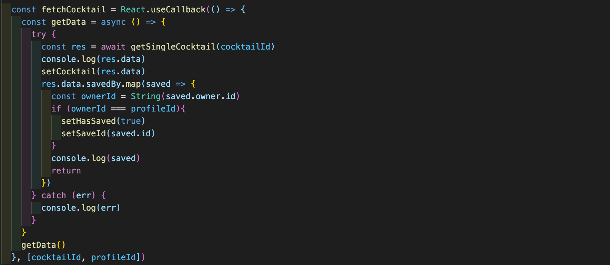

# Overview

### Team Members
[Esin Yilmazbilek](https://github.com/EsinYilmazbilek)
[Aromi Afolabi](https://github.com/aromiafolabi)

My final dev project for the Software Engineering Immersive course, a complex full-stack application built with Django REST Framework and React.

Honey & Thyme is a Pinterest clone app for cocktails. A pair project built over 7 days, it consists of a landing page where users need to sign in or register, an index page with a search bar where users can click on a cocktail card, a show page for the clicked cocktail where users can leave comments and save the cocktail onto their profile. Users can also go to their profile page where they can review their saved cocktails.

Please note that user authentication is required, anyone interested in viewing the app is welcome to use these credentials:
Email: betty@email
Password: pass

# Brief:
1. Build a full-stack application by making your own backend and your own front-end.
2. Use a Python Django API using Django REST Framework to serve your data from a Postgres database.
3. Consume your API with a separate front-end built with React.
4. Be a complete product with multiple relationships and have multiple models.

# Deployment
The app has been deployed with Heroku and Netlify and is available [here](https://honeyandthyme.netlify.app/).

# Timeframe
7 days

# Goal
* To build a full stack application with multiple components.

# Technologies Used
* Bootstrap
* CSS
* JavaScript
* React
* Axios
* Django
* Django REST framework
* Phython
* GitHub
* Git

# Process
### Planning:
I wanted to build a clone app for my final project of the course and as Pinterest is a platform I regularly use I decided on making a Pinterest clone. My teammate Aromi suggested that we build it for cocktails and Honey & Thyme was born. 

As a pair, we started the process with designing the pages and planning our steps for our MVP and the stretch goals. 

Then, we sketched out an Entity Relationship Diagram for the database architecture before we started with the back end.

### Build:
On day 1, we started building the backend. This was our first experience of creating a back-end using Python. We used Django and Django REST Framework to create a PostgreSQL database with RESTful features. 

During the 7 days, we worked together on every step via Zoom, completing each component and ticking them off the list.

We used Git and GitHub for version control and did our pushes and pulls together to avoid any potential Git issues or merge conflicts that may arise.

### Back end:
1. We built all the essential models and serializers with Django as in the examples below.

2. As we moved forward, we tested all models using Insomnia - making sure all relationships between models were correct and that we were receiving the correct JSON responses. 

3. Once we got the desired responses, we were ready to start building the front end with React.

### Front end:
1. We first started building a basic navbar and the homepage where we display unclickable cocktail cards.

2. To display the cocktail cards and give them a Pinterest look on both the home and index pages, we used Masonry which helped with fast and responsive rendering of the images. 

3. The difference is that on the home page above the cards are not clickable, and the cards on the index page below have another map to filter the cocktails based on the search results.

4. We then built the show pages for the cocktails, and used React useCallBack to fetch the cocktail data from the API.

5. Mapping through the details from the seeds file on the backend, we fetched the data (such as image, name of the cocktail, recipe etc.) to display on the show page.

6. We built separate React components for the chat form and chat card, then imported them into our Cocktail Show file.

7. On the show page of a cocktail we added a text box for the users to leave comments, and delete their own comments if they wish. We used profile Id and cocktail Id to place the comments on the cocktail page.

8. We also added a Save/Remove Save toggle for users to add the cocktails they wanted onto their profile pages.

9. As we were coming towards the final day, we separated some of the remaining tasks. Aromi built a pop up feature to appear on the home page after 6 seconds if the user is not logged in. It welcomes the users and directs them to either the login or register pages. 

10. Based on my experience from the Project 3 of the course we worked on building a responsive navbar with a burger menu that conditionally renders the navbar items if a user is logged in or not. 

11. I worked on getting the pages to look like their Pinterest counterparts as much as possible. This has been the most CSS heavy project with 885 lines I wrote on the main.scss file.

# Challenges
* The biggest challenge was building a full stack app a week into learning Python and Django.
* Not being fully comfortable with the new langage, we had to let go of certain features we wanted to add as the way we built was different and we had only 7 days to complete the project.
* Unfortunately our instructor wasn’t available during the project week so a temporary instructor filled in to support us. This had both challenges and wins as after 11 weeks of having the same person, we had to learn to work with someone new on a tight project schedule but it also forced us to find solutions and debug the issues we had ourselves. 

# Wins
* Having a teammate who I worked well with was definitely a win.
* Having a clear idea on what we wanted to build allowed us to work smoothly towards a deadline.
* Our app looks like how we imagined it and we have the majority of the features we wanted to include. 

# Future Improvements 
* Allowing the users to create, upload and edit their own cocktail recipes.
* Adding ‘likes’ onto the comments.
* Allowing users to create boards where they can save different cocktails to.
* Improving the search bar, so the searched word gets cross checked with any word existing in the cocktails data.

# Key Learnings
1. This was the first project I worked on with a pop up feature, and now I can use it in my future projects.
2. While learning a new language and a framework, being able to overcome the issues on this project helped boost my confidence as a developer.
3. This also pushed me out of my comfort zone and motivated me to deepen my knowledge of Python and Django by repeating my course materials and doing further studies. 

